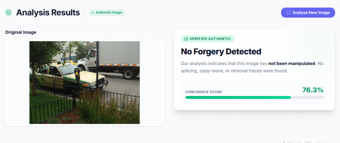
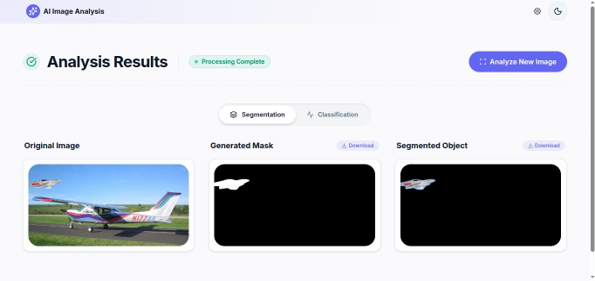
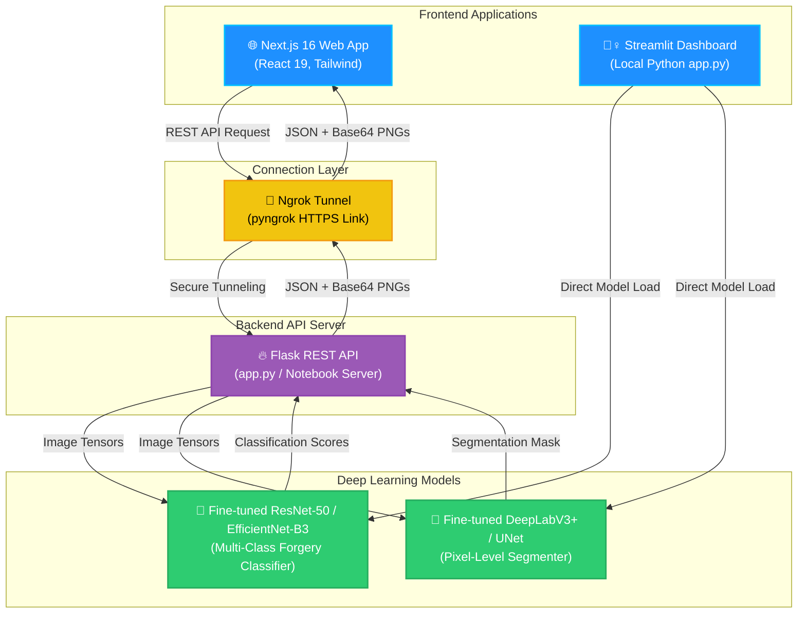

# 🕵️‍♀️ DeFacto Forensics: AI-Powered Image Manipulation & Segmentation

[](https://www.python.org/)
[](https://react.dev/)
[](https://nextjs.org/)
[](https://tailwindcss.com/)
[](https://opensource.org/licenses/MIT)

An advanced, state-of-the-art computer vision forensic suite designed to combat media tampering, fake news, and image forgery. By leveraging a **Dual-AI Architecture**, **DeFacto Forensics** integrates high-accuracy multi-class forgery classification with pixel-level localization (segmentation) of manipulated regions. 

This repository contains fine-tuned deep learning models, a remote-scalable Flask API backend with automatic Ngrok tunneling, a sleek Python-based Streamlit desktop application, and a stunning, premium Next.js 16 web dashboard.

---

## 🎨 Visual Walkthrough & Demo

Explore the visual capabilities of DeFacto Forensics, showcasing both the modern Next.js web application and the detailed analysis visualization dashboard.

### 1. Non-manipulated Images



### 2. Manipulated Images



---

## 🚀 Key Features

*   **Dual-AI Architecture**: Combines multi-class classification models (ResNet-50 / EfficientNet-B3) with semantic segmentation models (DeepLabV3+ / UNet) to simultaneously answer *if* an image was tampered with, *how* it was tampered with, and *where* the manipulation occurred.
*   **Comprehensive Forgery Detection**: Supported manipulation classes fine-tuned on the industry-standard **DeFacto** dataset:
    *   **Splicing**: Inserting regions from other source images.
    *   **Copy-Move**: Cloning and pasting sections within the same image.
    *   **Inpainting**: Digitally filling-in/removing objects using generative techniques.
    *   **Face Manipulation**: Neural swap, face-tuning, or deepfake facial edits.
*   **Dual Deployment Frontends**:
    *   **Next.js 16 Web Dashboard**: Built with React 19, TypeScript, Lucide Icons, and Motion, offering custom dark/light themes, remote API config, and instant downloads of isolated masks and object crops.
    *   **Streamlit Desktop App**: A lightweight Python interface (`app.py`) styled with custom dark-neon CSS, featuring local model inference, real-time threshold sliders, and interactive color maps.
*   **GPU-Tuned Flask Backend**: Designed to run seamlessly in high-performance cloud environments (like Kaggle or Google Colab T4 GPUs). It uses `pyngrok` to automatically generate secure HTTPS tunnels, exposing model inference to local or web clients without complex port forwarding.

---

## 📐 Project Architecture



---

## 📂 Directory Structure

```text
image-manipulation-segmentation/
├── Backend/                                    # Deep Learning Training & Architecture
│   ├── EfficientNetB4BinaryClassification.ipynb # Fine-tuning notebook for EfficientNet binary classification
│   ├── ResNet50BinaryClassification.ipynb      # Fine-tuning notebook for ResNet50 multi-class classification
│   └── Segmentation.ipynb                      # Fine-tuning notebook for DeepLabV3+ ResNet-50 segmentation
├── Frontend/                                   # Next.js Modern Web Client
│   ├── src/
│   │   ├── app/                                # Next.js App Router (pages, layout, globals)
│   │   ├── components/                         # Interactive React UI Components (Upload, Results, Loader)
│   │   ├── services/                           # API Connection Layer (imageAnalysisApi.ts)
│   │   └── config/                             # App-wide configurations
│   ├── package.json                            # Node.js dependencies & execution scripts
│   └── tsconfig.json                           # TypeScript configuration
├── demo/                                       # Screenshot assets for documentation
│   ├── demo_pic_1.png
│   └── demo_pic_2.png
├── docs/                                       # Project Documentation & Reports
│   ├── Project Idea Proposal.pdf               # Initial project pitch and objectives
│   ├── Project Report.pdf                      # Comprehensive scientific write-up
│   └── Project Report Presentation.pptx        # Project slideshow
├── app.py                                      # Streamlit desktop dashboard (Python implementation)
├── DeepLearningModelSetup.ipynb                # Kaggle/Colab ready Flask REST API + Ngrok Tunneling Setup
└── README.md                                   # Project documentation (This file)
```

---

## 🧠 Model Training & Performance Details

The models were fine-tuned on the **DeFacto Image Forgery Dataset**, which incorporates a massive corpus of spliced, copy-moved, inpainted, and face-swapped images with high-resolution ground truth masks.

### 1. Classification (ResNet-50 / EfficientNet-B3)
*   **Backbone**: ResNet-50 (ImageNet Pretrained weights).
*   **Objective**: Multi-class categorization into four primary manipulation groups.
*   **Training Details**: Optimized using Adam (`learning_rate=1e-4` with decay), evaluated using Precision, Recall, Accuracy, and F1-Score metrics.

### 2. Segmentation (DeepLabV3+ / UNet)
*   **Backbone**: DeepLabV3+ with a ResNet-50 encoder / UNet with an EfficientNet-B0 encoder.
*   **Objective**: Pixel-level binary segmentation of tampered regions versus authentic backgrounds.
*   **Training Details**: Supervised with Binary Cross Entropy (BCE) combined with Dice Loss (`learning_rate=1e-4`). The model maps manipulated areas to a binary single-channel mask.

---

## ⚙️ Installation & Running Guide

### 🛠️ Prerequisites
*   **Python**: Version `3.9` to `3.11`
*   **Node.js**: Version `18.x` or higher (with `npm` or `yarn`)
*   **Ngrok Account**: A free account is required to generate a tunnel token if deploying the remote GPU backend.

---

### Step 1: Run the Backend & Ngrok Tunnel

You can host the backend Flask server locally or in a GPU-accelerated Jupyter Notebook environment (Kaggle/Colab) by executing the cells in [DeepLearningModelSetup.ipynb](file:///e:/Projects/image-manipulation-segmentation/DeepLearningModelSetup.ipynb).

1. Open `DeepLearningModelSetup.ipynb` inside your environment.
2. In the configuration cell, enter your Ngrok Auth Token:
   ```python
   NGROK_TOKEN = "your_ngrok_auth_token_here"
   ```
3. Run all cells. This will:
   * Install the necessary packages (`torch`, `segmentation-models-pytorch`, `flask-cors`, `pyngrok`).
   * Load the fine-tuned ResNet-50 classifier and DeepLabV3+ segmentation model checkpoints.
   * Start a Flask REST API on port `5000`.
   * Open a secure public tunnel via Ngrok.
4. Copy the generated **Public URL** (e.g., `https://xxxx-xx-xx.ngrok-free.app`) printed in the logs.

---

### Step 2: Start the Streamlit Dashboard (Python Client)

If you wish to run the streamlined Python dashboard locally with direct model weights:

1. Clone or navigate to the project directory:
   ```bash
   cd image-manipulation-segmentation
   ```
2. Create and activate a virtual environment:
   ```bash
   python -m venv venv
   # On Windows
   .\venv\Scripts\activate
   # On macOS/Linux
   source venv/bin/activate
   ```
3. Install required libraries:
   ```bash
   pip install streamlit torch torchvision timm albumentations segmentation-models-pytorch pillow opencv-python matplotlib numpy
   ```
4. Place your model checkpoints (`.pth` files) in a `trained_models/` folder.
5. Run the Streamlit app:
   ```bash
   streamlit run app.py
   ```
6. Open your browser and navigate to `http://localhost:8501`.

---

### Step 3: Start the Next.js Web Client

To run the high-fidelity React-based user interface:

1. Navigate to the `Frontend` directory:
   ```bash
   cd Frontend
   ```
2. Install dependencies:
   ```bash
   npm install
   ```
3. Boot up the local Next.js development server:
   ```bash
   npm run dev
   ```
4. Open your browser and head to `http://localhost:3000`.
5. Click on the **Settings Gear Icon** in the top navigation bar.
6. Paste the **Ngrok Public URL** (copied from Step 1) into the input box and save. The client is now connected to the remote GPU backend!

---

## 📡 API Contract (Flask Server)

The Next.js client connects to the Flask server via the `/analyze` route.

### 📥 Request Body
`POST /analyze` (form-data)
*   `image`: Binary file (JPEG, PNG, TIF)

### 📤 Response Payload
```json
{
  "status": "Fake",
  "fake_confidence": 98.4,
  "manipulation_type": "splicing",
  "type_confidence": 92.1,
  "mask": "base64_encoded_png_mask...",
  "overlay": "base64_encoded_png_overlay...",
  "masked_image": "base64_encoded_png_crop..."
}
```
*If authentic:*
```json
{
  "status": "Real",
  "confidence": 99.8,
  "message": "The image is determined to be authentic."
}
```

---

## 📜 License & Acknowledgments

This project is licensed under the **MIT License** - see the LICENSE file for details.
Special thanks to the creators of the **DeFacto Dataset** for providing the benchmarks, masks, and training parameters that enabled the fine-tuning of these models.

*Created as a final project for Computer Vision & Deep Learning (CV).*
🕵️‍♀️ **DeFacto Forensics** — Secure, Transparent, and Precise Media Verification.
